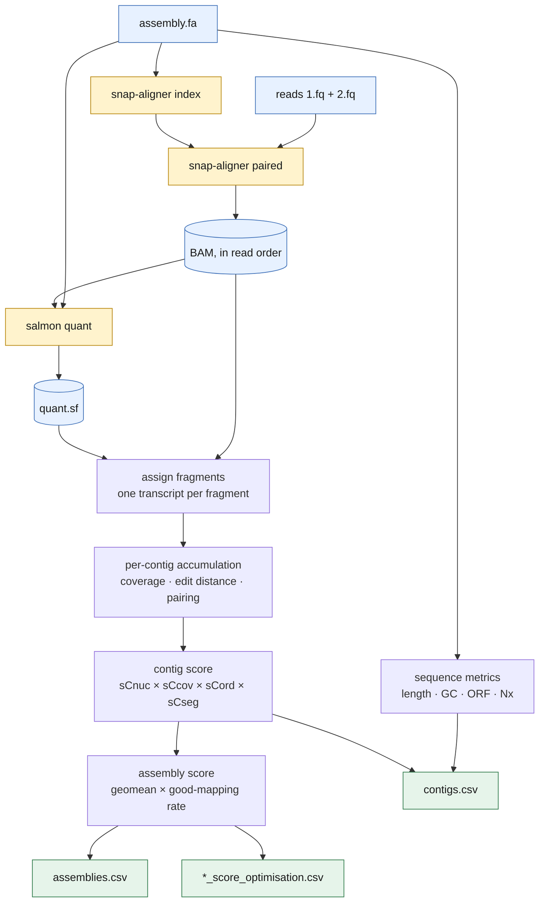

# pytransrate

Quality assessment of de-novo transcriptome assemblies.

pytransrate scores how well an assembly is supported by the reads it was built
from. It maps the reads back, quantifies expression, and reduces the result to
a per-contig score and a single assembly score, so you can compare assemblies
and separate well-supported contigs from junk. No reference is needed.

It is a Python implementation of the method in
[transrate](https://github.com/blahah/transrate) (Smith-Unna et al. 2016),
targeting current versions of its dependencies.

> **pytransrate does not reproduce the original's scores, and does not try to.**
> The rename exists so nobody compares the two sets of numbers by accident.
> [CHANGELOG.md](CHANGELOG.md) says exactly what changed and by how much.

## How it works



Amber steps are external binaries; everything else is in-process. Without
`--left`/`--right` only the `sequence metrics` branch runs, and `contigs.csv`
carries just those columns.

## Install

```bash
micromamba create -y -p ./env -c conda-forge -c bioconda \
    python=3.11 numpy scipy pysam snap-aligner=2.0.5 salmon=2.7.0 pip
./env/bin/pip install .
```

`conda` and `mamba` work the same way. snap-aligner and salmon must be on
`PATH` at run time.

## Use

```bash
pytransrate -a assembly.fa --left reads.1.fq --right reads.2.fq -t 16 -o results
```

Outputs land in `results/`:

| file | contents |
| --- | --- |
| `assemblies.csv` | one row of assembly-level metrics; `score` and `optimal_score` are columns 37 and 38 |
| `contigs.csv` | per-contig metrics; `score` is column 9 |
| `<assembly>_score_optimisation.csv` | the cutoff/score curve the optimiser walked |

Column *order* in both files is an interface, not presentation — downstream
tools read them positionally, and `tests/test_output.py` pins the indices.

Sequence metrics alone, with no aligner needed:

```bash
pytransrate -a assembly.fa -o results
```

**[USAGE.md](USAGE.md)** is the full reference: every option, what each metric
means, how to read a score, tuning for large or repetitive assemblies, the
comparison tooling, and troubleshooting.

## Reading the score

A contig scores `sCnuc × sCcov × sCord × sCseg`, each floored at 0.01:

| | measures | falls when |
| --- | --- | --- |
| `sCnuc` | per-base accuracy | reads disagree with the contig sequence |
| `sCcov` | coverage | parts of the contig have no reads over them |
| `sCord` | pairing | mates land wrongly, too far apart, or on another contig |
| `sCseg` | uniformity | coverage looks like two transcripts joined together |

The assembly score is the geometric mean of contig scores, scaled by the
fraction of fragments that map consistently. `optimal_score` is the best score
reachable by discarding low-scoring contigs, and `cutoff` is where to cut.

Scores are comparable **between assemblies of the same reads**. They are not
comparable across libraries, and not comparable to the Ruby transrate's.

## Tests

```bash
./env/bin/python -m pytest
```

The end-to-end tests in `tests/test_pipeline.py` need snap-aligner and salmon
on `PATH` and skip without them. The rest run anywhere.

Where possible the implementation is checked against something that is not
itself: the segmentation model against a linear-space transcription of the
original C++, coverage against `samtools depth`, and base composition and ORF
length against the original C extension, compiled on demand from
`tests/oracle/orf_oracle.c`. The sequence-only outputs have also been compared
against the Ruby implementation on three real assemblies, ~325,000 contigs,
and agree.

## Credit

The method, the score, and the research behind them are **not ours**. They are
the work of Richard Smith-Unna, Chris Boursnell, Rob Patro, Julian Hibberd and
Steven Kelly, published in *Genome Research* in 2016. This repository is a
fork of [blahah/transrate](https://github.com/blahah/transrate) and its history
goes back to their first commit in 2013; versions through 1.0.3 are theirs.

pytransrate exists because that implementation can no longer be installed or
run, not because there was anything wrong with it. Where its behaviour is
odd but deliberate, this port reproduces the oddity rather than "fixing" it —
those places are marked in the source at `BINNING_QUIRK`,
`FRAGMENT_ESTIMATOR`, `CUTOFF_BOUNDARY`, `STATS_QUIRK` and
`ORF_CASE_SENSITIVITY`.

If you use pytransrate, **cite the original paper** — see
[CITATION.md](CITATION.md):

> Smith-Unna R, Boursnell C, Patro R, Hibberd JM, Kelly S. (2016) TransRate:
> reference-free quality assessment of de novo transcriptome assemblies.
> *Genome Research*. doi:[10.1101/gr.196469.115](http://dx.doi.org/10.1101/gr.196469.115)

## License

MIT, as the original. See [LICENSE](LICENSE).
